# UnlockX Arbitrage Flow Chart

## Complete Arbitrage Process Flow

```mermaid
graph TB
    Start([👤 User starts with 500 USDC]) --> Deploy[📄 Deploy PIV Contract via Router]
    Deploy --> FlashLoan[⚡ Initiate Flash Loan Migration]
    
    subgraph "Phase 1: Position Setup via Flash Loan"
        FlashLoan --> FL1[🏦 Flash borrow 2000 USDC from Aave]
        FL1 --> FL2["💰 Total available: 2500 USDC
        (500 initial + 2000 borrowed)"]
        FL2 --> FL3[📈 Purchase 1 pt-ETH for 2500 USDC]
        FL3 --> FL4[🔒 Deposit pt-ETH as collateral in Aave]
        FL4 --> FL5[💸 Borrow 2000 USDC against collateral]
        FL5 --> FL6[↩️ Repay flash loan: 2000 USDC + premium]
        FL6 --> Result1["✅ Net position: 1 pt-ETH collateral
        2000+ USDC debt on Aave"]
    end
    
    Result1 --> Migrate[🔄 Migrate Aave position to PIV]
    
    subgraph "Phase 2: Migration to PIV"
        Migrate --> M1[⚡ Flash loan 2000+ USDC]
        M1 --> M2[💳 Repay existing Aave debt]
        M2 --> M3[📤 Transfer aToken to PIV contract]
        M3 --> M4["💸 PIV borrows new debt amount
        (original + premium)"]
        M4 --> M5[↩️ Repay flash loan]
        M5 --> Result2["✅ Position now managed by PIV
        with slightly higher debt"]
    end
    
    Result2 --> Order[📋 Place Sell Order]
    
    subgraph "Phase 3: Order Placement"
        Order --> O1[💎 Create order: Sell 1 pt-ETH at 3000 USDC]
        O1 --> O2[⏳ Wait for favorable market conditions]
        O2 --> Market{🎯 pt-ETH price reaches 3000 USDC?}
    end
    
    Market -->|Yes| Execute[🎊 Order Execution]
    Market -->|No| O2
    
    subgraph "Phase 4: Arbitrage Execution"
        Execute --> E1[💰 Buyer pays 3000 USDC for pt-ETH]
        E1 --> E2[💳 PIV repays debt: ~2000 USDC]
        E2 --> E3[📤 Transfer pt-ETH to buyer]
        E3 --> E4["💵 Net profit: ~1000 USDC
        (3000 - 2000 - fees)"]
        E4 --> Final["🎉 Total return: 500 initial + 1000 profit
        = 1500 USDC (200% gain)"]
    end
    
    subgraph "Key Benefits"
        B1["🚀 Leveraged Exposure
        500 USDC controls 2500 USDC position"]
        B2["💡 Amplified Returns
        20% pt-ETH gain = 200% portfolio gain"]
        B3["⚡ Flash Loan Efficiency
        No additional capital required"]
        B4["🔄 Automated Execution
        Orders execute when price targets hit"]
    end
    
    style Start fill:#e1f5fe
    style Final fill:#c8e6c9
    style B1 fill:#fff3e0
    style B2 fill:#fff3e0
    style B3 fill:#fff3e0
    style B4 fill:#fff3e0
```

## Detailed Step-by-Step Breakdown

### 🔢 **Mathematical Analysis**

#### Initial Position Setup:
- **Starting Capital**: 500 USDC
- **Flash Loan**: 2,000 USDC  
- **Total Available**: 2,500 USDC
- **pt-ETH Purchase**: 1 pt-ETH @ 2,500 USDC
- **Debt Created**: ~2,020 USDC (including flash loan premium)

#### Arbitrage Execution:
- **Sell Price**: 3,000 USDC (20% appreciation)
- **Debt Repayment**: 2,020 USDC
- **Net Profit**: 980 USDC
- **Total Portfolio Value**: 1,480 USDC
- **ROI**: 196% on initial 500 USDC

### 📊 **Risk-Reward Profile**

```mermaid
graph LR
    subgraph "Risk Factors"
        R1[📉 pt-ETH Price Decline]
        R2[💸 Liquidation Risk]
        R3[⛽ Gas Costs]
        R4[🏦 Flash Loan Fees]
    end
    
    subgraph "Reward Mechanisms"
        RW1[🚀 Leveraged Gains]
        RW2[💰 Spread Arbitrage]
        RW3[⚡ Capital Efficiency]
        RW4[🎯 Automated Execution]
    end
```

### 🔄 **Contract Interaction Flow**

## 💡 **Key Advantages of This Strategy**

1. **Capital Efficiency**: Use 500 USDC to control a 2,500 USDC position
2. **Amplified Returns**: 20% asset appreciation becomes 200% portfolio gain
3. **Automated Execution**: Orders execute automatically when price targets are met
4. **Flash Loan Integration**: No need for additional borrowing capital
5. **Composable DeFi**: Combines Aave lending with custom order book

## ⚠️ **Risk Considerations**

- **Liquidation Risk**: If pt-ETH falls below liquidation threshold
- **Market Risk**: pt-ETH price may not reach target levels
- **Smart Contract Risk**: Protocol vulnerabilities
- **Gas Costs**: Network congestion affecting profitability