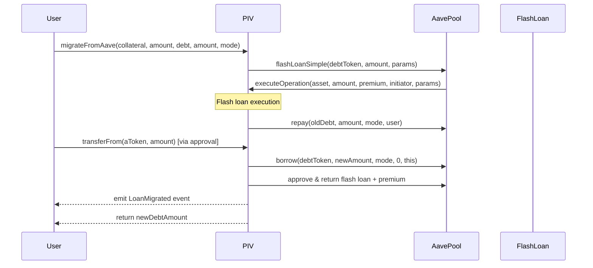
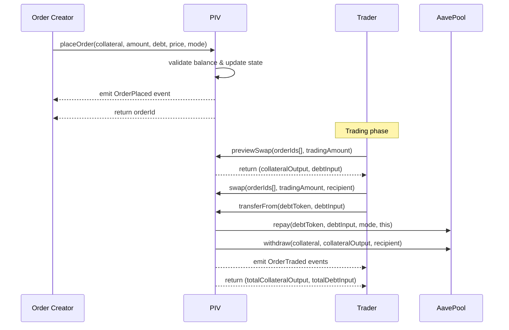
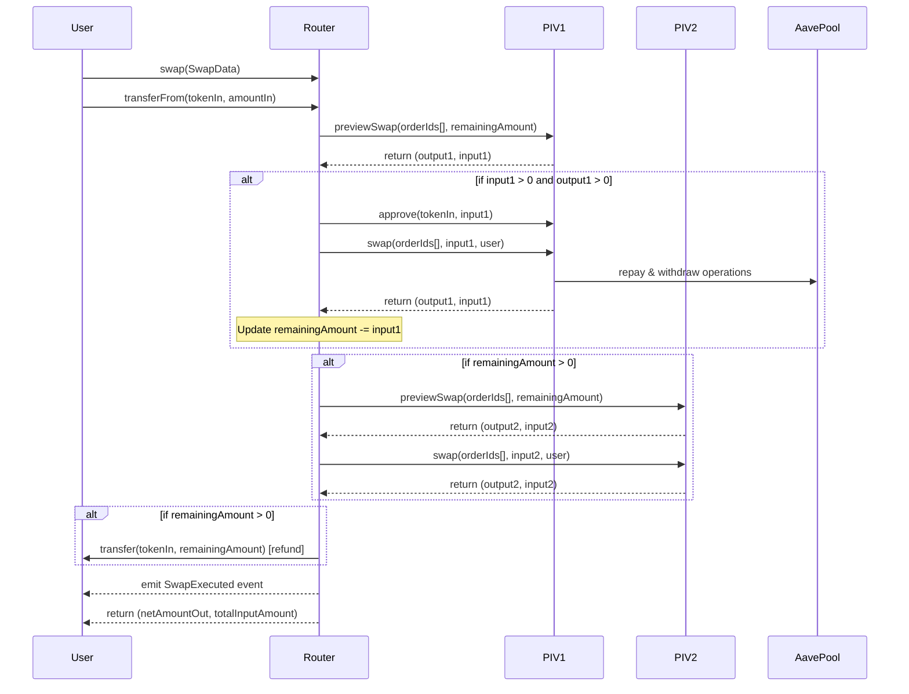
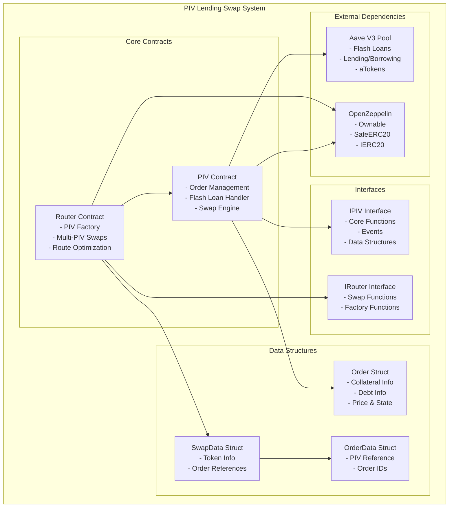
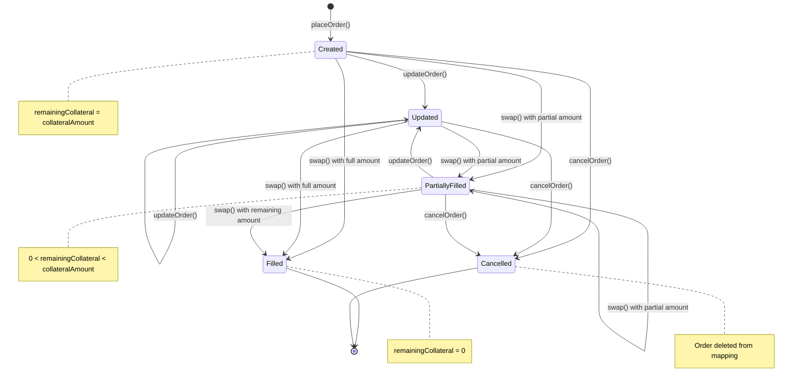

# PIV Lending Swap System - UML Diagram

## Class Diagram

```mermaid
classDiagram
    class IPIV {
        <<interface>>
        +struct Order
        +totalOrders() uint256
        +migrateFromAave(address, uint256, address, uint256, uint256) uint256
        +atokenAddress(address) address
        +placeOrder(address, uint256, address, uint256, uint256) uint256
        +updateOrder(uint256, uint256, uint256)
        +cancelOrder(uint256)
        +previewSwap(uint256[], uint256) (uint256, uint256)
        +swap(uint256[], uint256, address) (uint256, uint256)
        
        <<events>>
        +LoanMigrated(address, address, address, uint256, uint256, uint256)
        +OrderPlaced(address, uint256, address, address, uint256, uint256, uint256)
        +OrderUpdated(uint256, uint256)
        +OrderCancelled(uint256)
        +OrderTraded(uint256, uint256)
    }

    class Order {
        <<struct>>
        +address collateralToken
        +address debtToken
        +uint256 collateralAmount
        +uint256 remainingCollateral
        +uint256 price
        +uint256 interestRateMode
    }

    class PIV {
        -address POOL
        -address ADDRESSES_PROVIDER
        -uint256 totalOrders
        -mapping(uint256→Order) orderMapping
        -mapping(address→uint256) collateralOnSold
        
        +constructor(address, address, address)
        +executeOperation(address, uint256, uint256, address, bytes) bool
        +atokenAddress(address) address
        +migrateFromAave(IERC20, uint256, IERC20, uint256, uint256) uint256
        +placeOrder(address, uint256, address, uint256, uint256) uint256
        +updateOrder(uint256, uint256)
        +cancelOrder(uint256)
        +previewSwap(uint256[], uint256) (uint256, uint256)
        +swap(uint256[], uint256, address) (uint256, uint256)
        +withdrawAssets(address, uint256, address)
        +getBalance(address) uint256
        -_calculateCollateralOutput(address, uint256, address, uint256) uint256
        -_calculateDebtAmount(address, uint256, address, uint256) uint256
    }

    class IRouter {
        <<interface>>
        +struct OrderData
        +struct SwapData
        +deployPIV() address
        +swap(SwapData) (uint256, uint256)
        
        <<events>>
        +SwapExecuted(address, address, address, uint256, uint256)
        +PIVDeployed(address, address)
    }

    class OrderData {
        <<struct>>
        +address pivAddress
        +uint256[] orderIds
    }

    class SwapData {
        <<struct>>
        +address tokenIn
        +address tokenOut
        +uint256 amountIn
        +uint256 minAmountOut
        +OrderData[] orderDatas
    }

    class Router {
        -address POOL
        -address ADDRESSES_PROVIDER
        
        +constructor(address, address)
        +deployPIV() address
        +swap(SwapData) (uint256, uint256)
    }

    class IAaveV3FlashLoanReceiver {
        <<interface>>
        +executeOperation(address, uint256, uint256, address, bytes) bool
        +ADDRESSES_PROVIDER() address
        +POOL() address
    }

    class IAaveV3PoolMinimal {
        <<interface>>
        +flashLoanSimple(address, address, uint256, bytes, uint16)
        +repay(address, uint256, uint256, address) uint256
        +borrow(address, uint256, uint256, uint16, address)
        +withdraw(address, uint256, address) uint256
        +getReserveData(address) DataTypes.ReserveData
    }

    class Ownable {
        <<OpenZeppelin>>
        -address _owner
        +constructor(address)
        +owner() address
        +onlyOwner() modifier
        +transferOwnership(address)
        +renounceOwnership()
    }

    class IERC20 {
        <<interface>>
        +totalSupply() uint256
        +balanceOf(address) uint256
        +transfer(address, uint256) bool
        +allowance(address, address) uint256
        +approve(address, uint256) bool
        +transferFrom(address, address, uint256) bool
    }

    class SafeERC20 {
        <<library>>
        +safeTransfer(IERC20, address, uint256)
        +safeTransferFrom(IERC20, address, address, uint256)
        +safeIncreaseAllowance(IERC20, address, uint256)
    }

    class IERC20Metadata {
        <<interface>>
        +name() string
        +symbol() string
        +decimals() uint8
    }

    %% Inheritance relationships
    PIV --|> IPIV : implements
    PIV --|> IAaveV3FlashLoanReceiver : implements
    PIV --|> Ownable : extends
    Router --|> IRouter : implements

    %% Composition relationships
    IPIV *-- Order : contains
    IRouter *-- OrderData : contains
    IRouter *-- SwapData : contains
    SwapData *-- OrderData : contains

    %% Usage relationships
    PIV ..> IAaveV3PoolMinimal : uses
    PIV ..> IERC20 : uses
    PIV ..> SafeERC20 : uses
    PIV ..> IERC20Metadata : uses
    Router ..> PIV : creates
    Router ..> IPIV : uses
    Router ..> IERC20 : uses
    Router ..> SafeERC20 : uses

    %% Data flow relationships
    Router --> PIV : deploys & interacts
    PIV --> IAaveV3PoolMinimal : flash loans & operations
```

## Sequence Diagrams

### 1. Loan Migration Sequence

### 2. Order Placement & Trading Sequence

### 3. Router Multi-PIV Swap Sequence

## Component Diagram

## State Diagram - Order Lifecycle

## Key Design Patterns

### 1. **Factory Pattern**
- Router acts as a factory for PIV contracts
- Each user can deploy their own PIV instance

### 2. **Strategy Pattern**
- Multiple PIV contracts can have different trading strategies
- Router aggregates liquidity across multiple PIVs

### 3. **Flash Loan Pattern**
- Atomic operations for loan migration
- Borrow → Execute → Repay in single transaction

### 4. **Order Book Pattern**
- Decentralized order matching
- Price-time priority (implicit through order IDs)

### 5. **Proxy/Delegation Pattern**
- Router delegates swap execution to PIV contracts
- Abstraction layer for complex multi-PIV operations

This UML diagram provides a comprehensive view of your PIV lending swap system's architecture, showing the relationships between contracts, data flow, and system interactions.